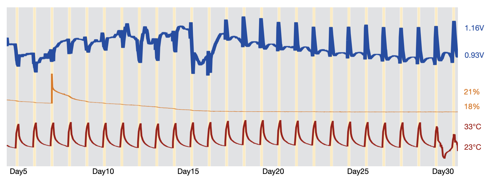
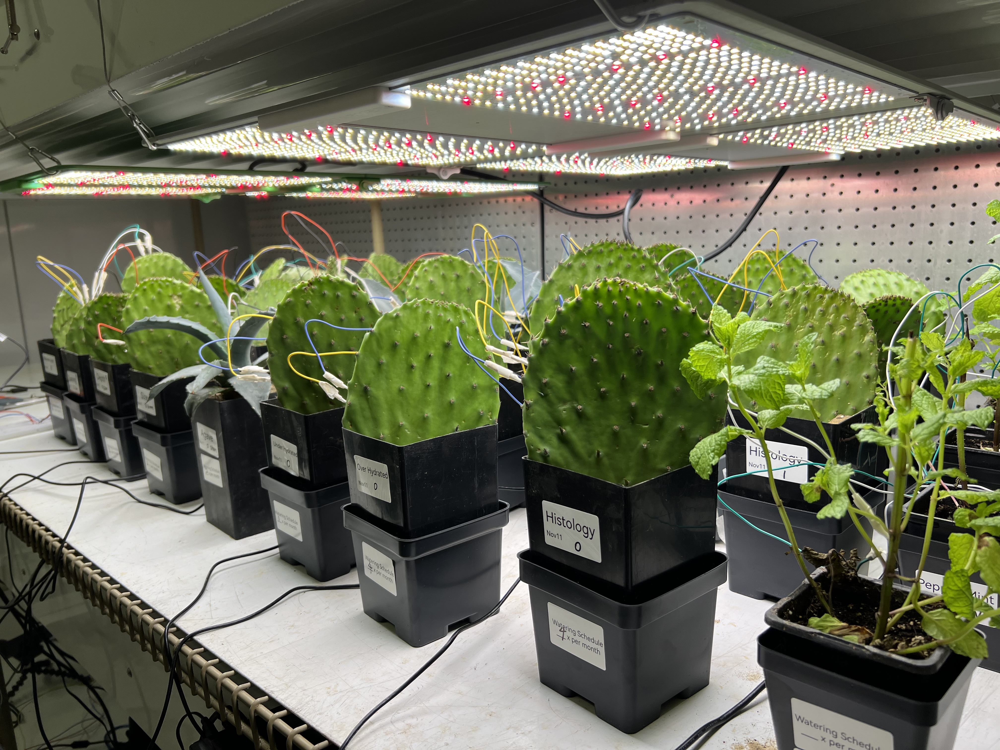
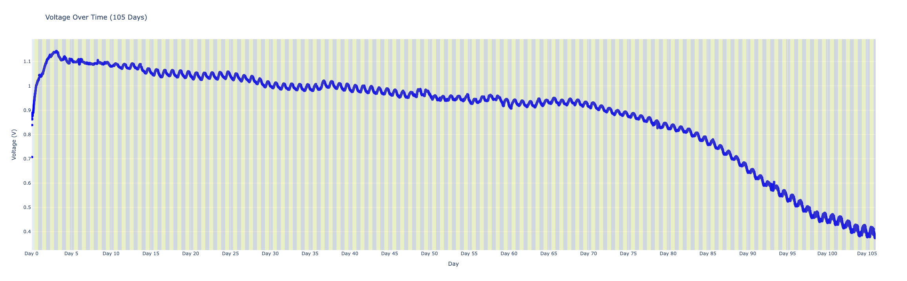
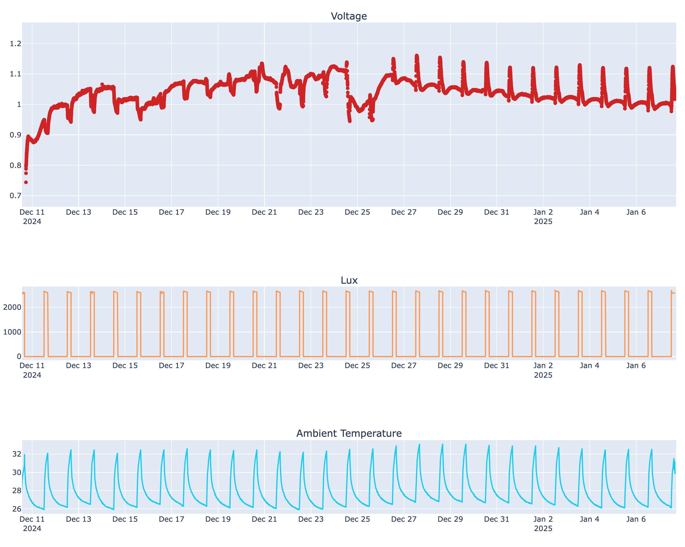
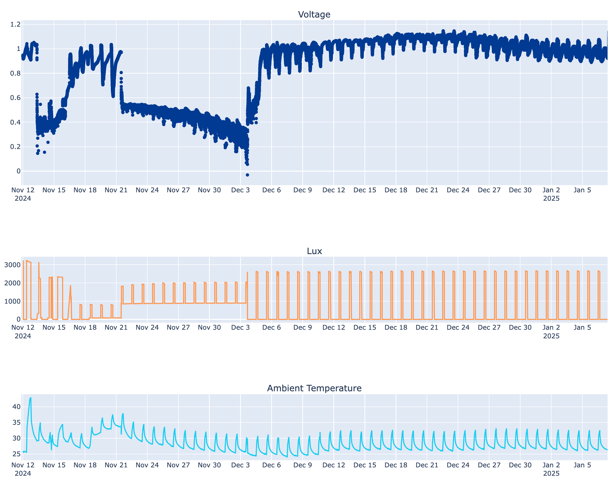
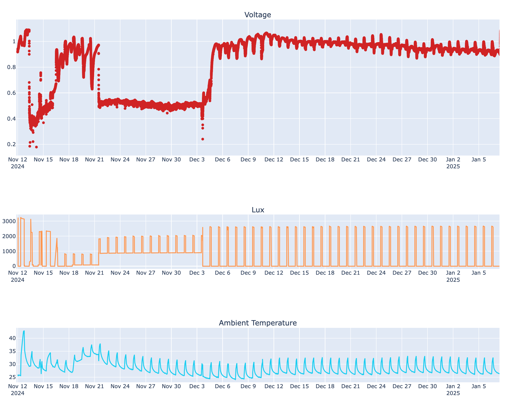
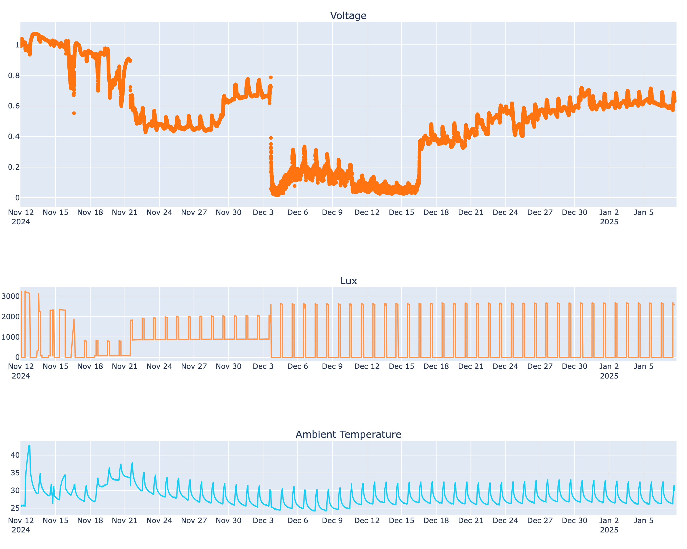

# photosynthesis-data

## Proposal Data 

[Download the CSV file](https://github.com/vak-lab-northwestern/photosynthesis-data/blob/main/voltage.csv)

## Setup

## 105Days data

## More Long term data

This repository serves as a location to access all of the data required to reproduce the plots seen on this page.  

This work is currently under invention disclosure and submitted for patent. This work is copyrighted and property of VAK Sustainable Ubiquitous Computing Laborthwestern University.
